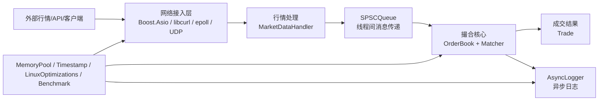
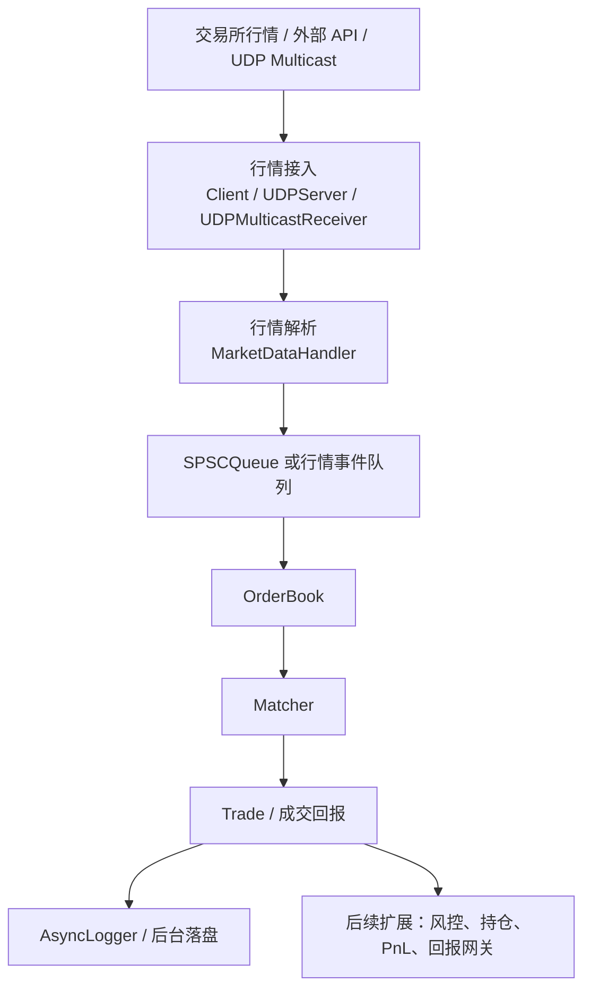

# 系统架构文档

## 1. 文档范围

本文基于 `README.md`、`HFT_OPTIMIZATIONS.md`、顶层 `CMakeLists.txt` 以及 `include/`、`src/` 下的实际代码结构，梳理本工程的系统目标、模块划分、核心数据流、构建关系和当前实现状态。

工程定位是一个面向高频交易场景的实时行情接入与订单撮合模拟系统，使用 C++20 实现，并强调 Linux 生产环境下的低延迟优化。当前主构建目标是 `MarketDataEngine`，它主要演示订单簿、撮合器、内存池、时间戳、异步日志和 SPSC 队列；行情与部分网络代码存在于工程中，但尚未完整接入主目标。

## 2. 总体架构

系统可以分为五层：

1. 应用入口层：`src/main.cpp`
2. 交易核心层：`include/order_matching/`
3. 行情与网络接入层：`include/market_data/`、`include/networking/`
4. 低延迟基础设施层：`include/utils/`
5. 构建与运行配置层：`CMakeLists.txt`、`build.sh`、`HFT_OPTIMIZATIONS.md`



当前 `src/main.cpp` 直接构造订单并调用撮合逻辑，更多是一个单进程演示程序，而不是完整的服务化交易网关。

## 3. 工程目录结构

```text
.
├── CMakeLists.txt
├── HFT_OPTIMIZATIONS.md
├── README.md
├── build.sh
├── libcurl-x64.dll
├── include/
│   ├── market_data/
│   │   └── MarketDataHandler.hpp
│   ├── networking/
│   │   ├── Client.hpp
│   │   ├── EpollServer.hpp
│   │   ├── Server.hpp
│   │   └── UDPServer.hpp
│   ├── order_matching/
│   │   ├── Matcher.hpp
│   │   ├── Order.hpp
│   │   └── OrderBook.hpp
│   └── utils/
│       ├── AsyncLogger.hpp
│       ├── Benchmark.hpp
│       ├── LinuxOptimizations.hpp
│       ├── MemoryPool.hpp
│       ├── SPSCQueue.hpp
│       ├── SPSCQueueExample.hpp
│       └── Timestamp.hpp
└── src/
    ├── CMakeLists.txt
    ├── main.cpp
    ├── market_data/
    │   └── MarketDataHandler.cpp
    ├── networking/
    │   ├── Client_main.cpp
    │   ├── Server_main.cpp
    │   ├── client.cpp
    │   └── server.cpp
    └── order_matching/
        ├── Matcher.cpp
        └── OrderBook.cpp
```

README 中提到的 `tests/`、`benchmarks/`、`third_party/`、`cmake/` 目录在当前工作区中不存在。实际存在的外部依赖痕迹包括 `libcurl-x64.dll`，以及代码中引用的 `../json/json.hpp`、`../boost_1_86_0/boost/asio.hpp`，但这些路径在当前目录树内未看到对应文件。

## 4. 核心模块说明

### 4.1 应用入口层

文件：`src/main.cpp`

职责：

- 校准 RDTSC，用于低开销延迟测量。
- 启动异步日志，输出到 `market_engine.log`。
- 在 Linux 下调用 HFT 初始化逻辑，包括 CPU 亲和性、内存锁定、实时优先级等。
- 创建 `OrderBook` 和 `Matcher`。
- 通过全局线程本地内存池 `g_order_pool` 分配示例订单。
- 将订单加入订单簿，调用 `matcher.matchOrders(orderBook)` 完成撮合。
- 演示 `SPSCQueue<Order*, 1024>` 的单生产者、单消费者通信模式。

这层目前承担“示例驱动”和“集成验证”角色，不包含真实交易协议、真实行情订阅或持续运行的撮合循环。

### 4.2 订单模型

文件：`include/order_matching/Order.hpp`

核心类型：

- `Price = int64_t`：价格使用定点整数表示。
- `PRICE_SCALE = 1'000'000`：微美元精度。
- `OrderId = uint32_t`
- `Quantity = uint32_t`
- `Timestamp = int64_t`
- `Order`：32 字节、32 字节对齐的订单结构。

`Order` 内部字段包括：

- `id`
- `quantity`
- `price_scaled`
- `timestamp_ns`
- `side`：`0` 为买，`1` 为卖。
- `order_type`：预留订单类型，注释中定义 `0=limit, 1=market, 2=ioc, 3=fok`。

设计重点是避免浮点误差、压缩结构体尺寸、改善缓存局部性。

### 4.3 订单簿

文件：`include/order_matching/OrderBook.hpp`

核心类：

- `PriceLevel`
- `OrderBook`

`PriceLevel` 表示单个价格档位，内部用 `std::vector<Order*>` 保持同价订单 FIFO 队列，同时维护该价位的总量。

`OrderBook` 使用：

- `std::map<Price, PriceLevel> buy_levels_`
- `std::map<Price, PriceLevel> sell_levels_`
- `std::unordered_map<OrderId, Order*> order_map_`
- `best_bid_price_`
- `best_ask_price_`

关键行为：

- `addOrder(Order*)`：校验订单、补时间戳、写入 ID 索引、加入买/卖价格阶梯。
- `cancelOrder(OrderId)`：按 ID 查找，再从对应价格档移除。
- `modifyOrder(OrderId, Price, Quantity)`：先撤单，再更新价格和数量，最后重入订单簿。
- `getBestBid()`：返回最高买价档的 FIFO 首单。
- `getBestAsk()`：返回最低卖价档的 FIFO 首单。
- `hasMatch()`：当 `best_bid_price_ >= best_ask_price_` 时可撮合。

复杂度特征：

- 新价格档插入：`O(log P)`
- 最优价访问：依赖 `std::map::rbegin()` / `begin()`，近似常数级。
- 同价位撤单：当前是线性扫描该价位订单队列，复杂度为 `O(N_level)`。

### 4.4 撮合器

文件：`include/order_matching/Matcher.hpp`

核心类型：

- `Trade`
- `Matcher`

撮合流程：

1. 循环判断 `orderBook.hasMatch()`。
2. 获取最优买单和最优卖单。
3. 如果买价低于卖价，则停止。
4. 成交价取更早时间戳订单的价格。
5. 成交量取买卖双方剩余量的较小值。
6. 记录 `last_trade_`。
7. 通过异步日志记录成交。
8. 扣减买卖双方数量。
9. 完全成交的订单通过 `orderBook.cancelOrder()` 移除。

该模块目前只保留最近一笔成交，没有成交流水列表、回报通道、持仓、风控或 PnL 模块。

### 4.5 行情处理层

文件：

- `include/market_data/MarketDataHandler.hpp`
- `src/market_data/MarketDataHandler.cpp`

设计意图：

- 使用 `Client` 从 Alpha Vantage 获取行情。
- 使用 `nlohmann::json` 解析 JSON。
- 抽取 symbol 和 close price。
- 后续可将行情转为订单、信号或订单簿更新。

当前状态：

- `MarketDataHandler.cpp` 的 include 语句存在缺失引号的问题。
- 解析字段写死了时间 `"2023-09-22 16:00:00"`。
- 没有把解析后的行情接入 `OrderBook` 或 `SPSCQueue`。
- 该模块没有被顶层 `CMakeLists.txt` 编入 `MarketDataEngine`。

### 4.6 网络层

网络层分为两类实现。

#### Boost.Asio/libcurl 业务接口

文件：

- `include/networking/Server.hpp`
- `src/networking/server.cpp`
- `include/networking/Client.hpp`
- `src/networking/client.cpp`
- `src/networking/Server_main.cpp`
- `src/networking/Client_main.cpp`

设计意图：

- `Server` 使用 Boost.Asio 接收 JSON 请求。
- 支持 `fetch_market_data` 和 `place_order` 两类请求。
- `Client` 使用 libcurl 拉取 Alpha Vantage 行情，也可向服务器发送请求。

当前状态：

- `server.cpp` 使用了旧接口形式，如 `Order<double>`、`AddOrder()`、`MatchOrders()`，与当前 `Order`、`OrderBook::addOrder()`、`Matcher::matchOrders()` 不匹配。
- `Server_main.cpp` 和 `Client_main.cpp` 直接 include `.cpp` 文件，不是常规构建方式。
- 该网络服务没有被顶层 CMake 编译为独立可执行文件。
- `Client::sendRequestToServer()` 使用 HTTP POST，而 `Server` 当前是基于 TCP 行读取 JSON 的协议，两者协议模型不一致。

#### Linux 低延迟网络能力

文件：

- `include/networking/EpollServer.hpp`
- `include/networking/UDPServer.hpp`

`EpollServer`：

- Linux only。
- 使用 `epoll_create1`、非阻塞 TCP socket、`SO_REUSEADDR`、`SO_REUSEPORT`、`TCP_NODELAY`。
- 支持 edge-triggered epoll。
- 通过回调 `MessageHandler` 交给上层处理。

`UDPServer` / `UDPMulticastReceiver`：

- Linux only。
- 使用非阻塞 UDP。
- 可开启 `SO_BUSY_POLL`。
- 支持 UDP multicast 行情接收。
- 支持批量读取多个 UDP 包。

这部分更符合 README 中的 HFT 网络优化目标，但当前没有在 `main.cpp` 中启动，也没有具体协议解析。

### 4.7 低延迟基础设施层

文件：`include/utils/`

主要组件：

- `MemoryPool.hpp`：线程本地 `OrderMemoryPool`，默认预分配 100 万个 `Order`，避免热路径动态分配。
- `Timestamp.hpp`：提供 RDTSC、RDTSCP、`clock_gettime`、延迟计时器和 RDTSC 校准器。
- `LinuxOptimizations.hpp`：封装 `mlockall`、CPU affinity、thread pinning、NUMA 亲和、实时优先级等 Linux 优化。
- `SPSCQueue.hpp`：单生产者单消费者有界环形队列，使用 cache line 对齐避免 false sharing。
- `AsyncLogger.hpp`：基于 SPSC queue 的异步日志，热路径入队，后台线程落盘或输出。
- `Benchmark.hpp`：延迟统计与分位数计算工具。
- `SPSCQueueExample.hpp`：线程间通信使用示例。

## 5. 关键运行时数据流

### 5.1 当前主程序演示流

```mermaid
sequenceDiagram
    participant Main as main.cpp
    participant Opt as LinuxOptimizations
    participant Pool as OrderMemoryPool
    participant Book as OrderBook
    participant Matcher as Matcher
    participant Logger as AsyncLogger

    Main->>Logger: start("market_engine.log")
    Main->>Opt: initializeHftOptimizations(cpu=0, priority=50)
    Main->>Pool: allocate()
    Pool-->>Main: Order*
    Main->>Book: addOrder(Order*)
    Main->>Matcher: matchOrders(Book)
    Matcher->>Book: getBestBid()/getBestAsk()/hasMatch()
    Matcher->>Logger: info("Trade...")
    Matcher->>Book: cancelOrder(filled order)
    Main->>Logger: flush()/stop()
```

### 5.2 目标形态的数据流

README 描述的目标形态更接近以下链路：



当前代码已经具备部分组件，但从行情接入到订单簿的端到端路径尚未闭环。

## 6. 构建架构

顶层 `CMakeLists.txt` 定义唯一主目标：

```text
MarketDataEngine =
  src/main.cpp
  src/order_matching/OrderBook.cpp
  src/order_matching/Matcher.cpp
```

链接依赖：

- `Threads::Threads`
- 可选 `Boost`
- 可选 `CURL`
- Linux 下链接 `rt`
- 如果找到 NUMA 库，则链接 `numa` 并定义 `HFT_NUMA_AVAILABLE`

Release 优化：

- `-O3`
- `-march=native`
- `-mtune=native`
- `-flto`
- `-ffast-math`
- `-funroll-loops`
- `-fno-exceptions`
- `-fno-rtti`
- `-finline-functions`
- `-fomit-frame-pointer`

平台假设：

- README 明确说明项目面向 Linux。
- macOS/Windows 上 Linux-specific API 不可用，完整构建可能失败或只能部分构建。

## 7. 设计原则

### 7.1 热路径少分配

订单由 `OrderMemoryPool` 分配，默认线程本地预分配 100 万个 `Order`。这避免了撮合热路径中的频繁 `new/delete`。

### 7.2 定点价格

价格使用 `int64_t` 定点数，不使用浮点数参与撮合判断，从而避免浮点误差和非确定性。

### 7.3 缓存友好

`Order` 被设计为 32 字节对齐结构。SPSC 队列读写索引和缓冲区也进行了 cache line 对齐，减少 false sharing。

### 7.4 头文件内联热路径

`OrderBook` 与 `Matcher` 的主要逻辑在头文件中实现，`src/order_matching/*.cpp` 仅保留兼容 include。这样便于编译器内联和跨模块优化。

### 7.5 Linux 优先

系统优化集中在 Linux API：

- `mlockall`
- `sched_setaffinity`
- `pthread_setaffinity_np`
- `sched_setscheduler`
- `epoll`
- `SO_BUSY_POLL`
- NUMA 相关 API

## 8. 当前实现状态与架构缺口

### 已实现并被主程序使用

- `Order`
- `OrderBook`
- `Matcher`
- `OrderMemoryPool`
- `Timestamp` / `LatencyTimerRDTSC`
- `LinuxOptimizations` 部分能力
- `SPSCQueue`
- `AsyncLogger`

### 已实现但未接入主程序

- `Benchmark`
- `EpollServer`
- `UDPServer`
- `UDPMulticastReceiver`
- `MarketDataHandler`
- Boost.Asio `Server`
- libcurl `Client`

### 与 README 或当前接口不一致的地方

- README 中列出的 `tests/`、`benchmarks/`、`third_party/`、`cmake/` 目录当前不存在。
- `MarketDataHandler.cpp` 有 include 语法问题。
- `include/market_data/MarketDataHandler.hpp` 引用 `"Client.hpp"`，但实际文件位于 `include/networking/Client.hpp`。
- `include/networking/Server.hpp` 引用 `../boost_1_86_0/boost/asio.hpp` 和 `../json/json.hpp`，当前目录树未见这些路径。
- `src/networking/server.cpp` 使用旧的模板订单与旧方法名，和当前撮合核心接口不兼容。
- `Client::sendRequestToServer()` 是 HTTP/libcurl 模型，`Server` 是 TCP 按行读 JSON 模型，协议不一致。
- 顶层 CMake 没有编译行情、网络、测试或 benchmark 目标。
- `OrderMemoryPool` 的 `free_list_` 被初始化但实际分配逻辑只使用 `next_free_`，当前不是真正可复用的 freelist。

## 9. 建议的后续架构演进

1. 统一订单 API：将网络层的 `place_order` 请求改成构造当前 `Order`，调用 `OrderBook::addOrder()` 和 `Matcher::matchOrders()`。
2. 统一协议模型：选择 TCP JSON 行协议、HTTP REST、或二进制低延迟协议中的一种作为主路径。
3. 接入行情到队列：让 `MarketDataHandler` 输出结构化行情事件或 `Order*`，通过 `SPSCQueue` 交给撮合线程。
4. 增加独立构建目标：为 `MarketDataEngine`、`Server`、`Client`、`BenchmarkOrderMatching` 分别建 target。
5. 补齐依赖管理：将 `nlohmann/json.hpp`、Boost、libcurl 的引用方式统一到 CMake。
6. 建立测试目录：覆盖订单新增、撤单、改价、部分成交、完全成交、同价 FIFO、买卖价穿透等核心行为。
7. 完善成交输出：从 `last_trade_` 扩展为成交事件队列，支持后台持久化或回报推送。
8. 明确线程模型：将行情接收线程、撮合线程、日志线程、网络回报线程的 CPU affinity 和 NUMA 策略配置化。

## 10. 总结

该工程的核心架构已经围绕 HFT 低延迟撮合建立了清晰的基础：定点价格、缓存对齐订单、价格阶梯订单簿、内存池、RDTSC 计时、SPSC 队列和异步日志。当前最成熟、最可运行的路径是 `src/main.cpp` 演示的本地订单簿撮合流程。

行情接入、网络服务、benchmark 和测试体系仍处于未完全整合状态。若要把它推进为完整系统，优先级最高的是统一订单接口和网络协议，并将行情/网络模块纳入 CMake 构建与端到端数据流。
